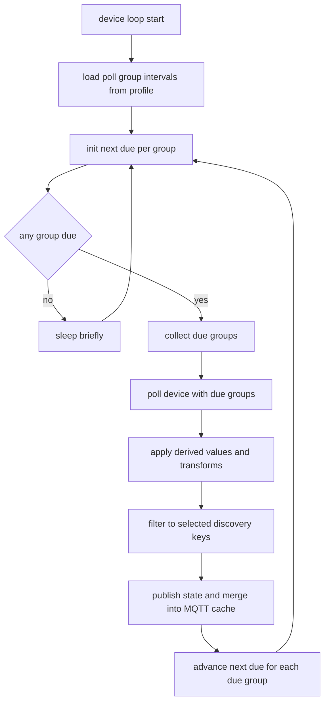
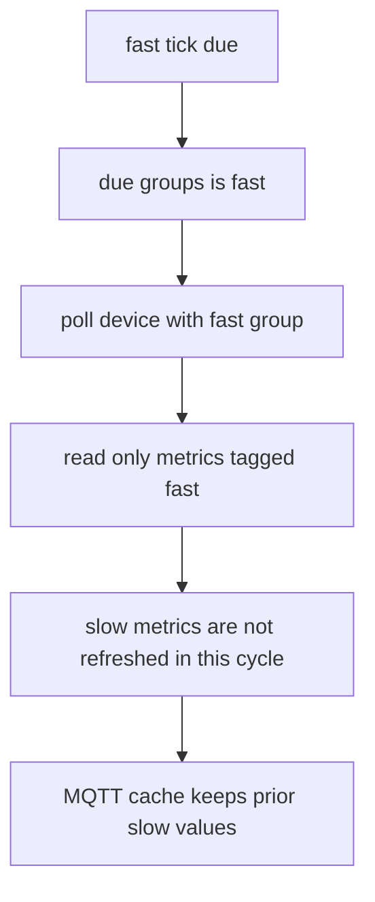
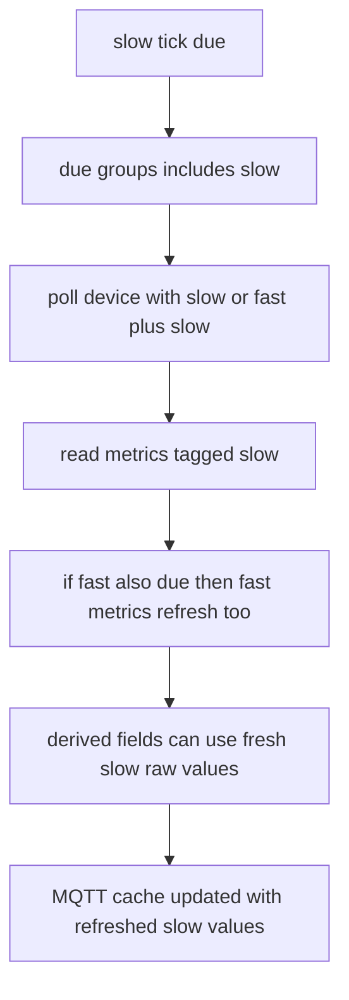
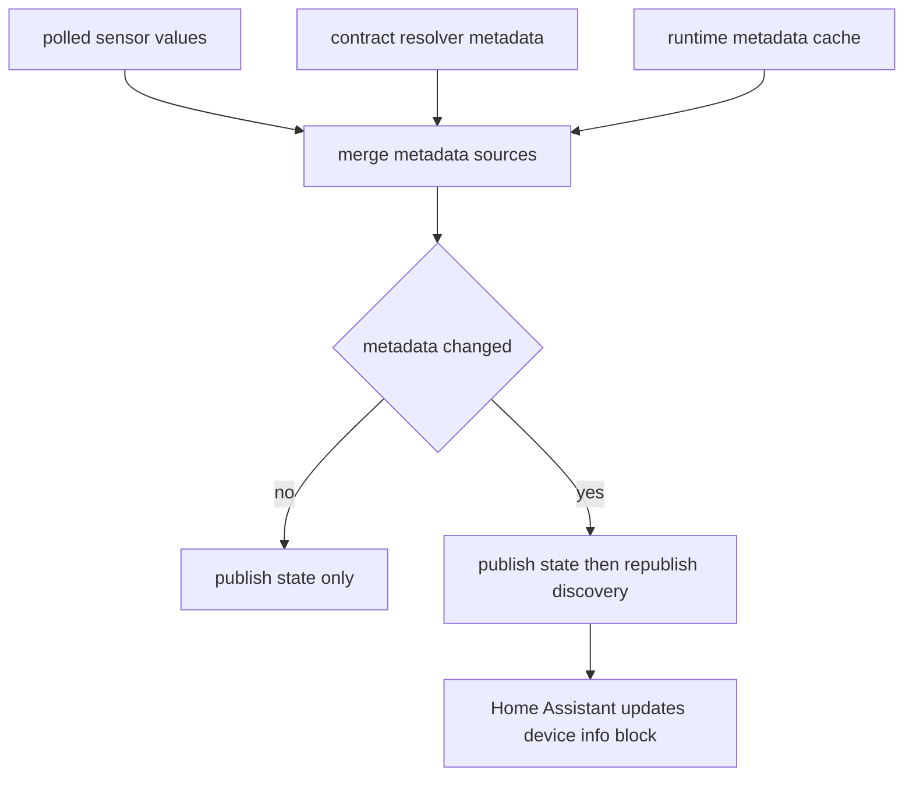

# ups2mqtt-standalone

Standalone Docker Compose deployment for `ups2mqtt`.

## Scope
This repository is intentionally trimmed for standalone deployment.
It includes runtime code and Compose configuration only, and excludes Home Assistant add-on packaging and unrelated development artifacts.

## Included
- `standalone/` Docker Compose runtime
- `ups2mqtt/rootfs/usr/src/app/` application runtime code

## Prerequisites
- Docker Engine (with Docker Compose v2)
- `make`

## Quick start
1. Create your env file at the repository root:
   - `cp standalone/.env.example .env`
2. Edit `.env` and set at minimum:
   - `UPS_UNIFIED_MQTT_HOST`
   - `UPS_UNIFIED_MQTT_PORT` (default `1883`)
   - `UPS_UNIFIED_MQTT_USERNAME` / `UPS_UNIFIED_MQTT_PASSWORD` if your broker requires auth
3. Edit `standalone/options.json` for runtime options and device definitions (`config` YAML payload).
4. Start the stack:
   - `make dev-up`
5. Verify:
   - `make dev-ps`
   - `make dev-logs`
   - UI: `http://localhost:8099/htmx/devices` (startup page)

## Common commands
- Start/build: `make dev-up`
- Rebuild only: `make dev-build`
- Restart service: `make dev-restart`
- Tail logs: `make dev-logs`
- Stop stack: `make dev-down`

## Current Status
- The core runtime reuses proven code from related UPS apps; some UI/display differences are still expected.
- Development is currently focused on this standalone deployment for convenience.
- Direction is toward a Home Assistant add-on/app model (not HACS).
- This standalone instance avoids loading Home Assistant core resources directly and reduces main-loop impact.

## Driver Coverage
- APC Smart UPS (legacy Modbus and legacy SNMP): supported.
- APC PDU: limited support.
- APC SMT devices: supported.
- RFC1628 UPS devices: expected to be supported.
- CyberPower Modbus devices: supported.

## Home Assistant + MQTT Notes
- Tested against Mosquitto MQTT broker in Home Assistant.
- You must create/use an MQTT user for this app.
- Discovery adds/removes entities through MQTT discovery; polling must also be enabled.
- Disabling discovery or deleting a device should remove visible HA values.
- If a deleted ups2mqtt device still appears in HA, remove the device manually in Home Assistant.
- Home Assistant token is not required for normal operation.
- Home Assistant token is used during device reinitialization to remove stale entity data for that device.
- Device list rows include an `HA Payload` modal for read-only preview of currently cached Home Assistant payload data (including empty/not-found states) without publishing MQTT or regenerating discovery.

## Profiles, Polling, and Runtime Behavior
- Global Profiles are functional.
- Local Profiles are work in progress.
- Import/export exists and can be useful, but it is not thoroughly tested yet.
- Recommended usage: create multiple Global Profiles per scenario (for example `SMT-UIO1-temp-humidity`) and assign one per device.
- Profile sensor selection is now single-toggle: if a sensor is selected it is published to MQTT and discovered by Home Assistant.
- The previous per-sensor `HA visible` option was removed. Existing stored `ha_visible` values are ignored.
- The app currently has 8 polling slots and uses a simple semaphore to share polling resources.
- The polling model is tunable for larger workloads compared with fixed Home Assistant add-on defaults.
- Ignore slow/fast poll settings for now; that concept is not fully wired through and will change.
- `Keep Conn` improves TCP/Modbus efficiency when the NMC keepalive is configured (around 300 seconds).
- The local log buffer is for troubleshooting and does not persist across restarts/reboots.

## Polling Flow Diagrams

## Human-Readable Mapping Policy
- Runtime output is now human-readable for mapped status/code fields.
- Integer code fields (for example `output_source`, `battery_status`) publish companion text fields (`output_source_text`, `battery_status_text`).
- Raw bitfield sensors (`*_bf`) are not exposed in profile selection, discovery, or published state.
- Bitfields are decoded into named boolean state fields (for example `ups_online_state`, `ups_on_battery_state`).
- APC Smart-UPS legacy Modbus now decodes `status_word_1`, `status_word_2`, and `status_word_3` into named state flags (fault, power-source, overload, and battery state indicators).
- When a required mapping is missing, the runtime logs a warning and suppresses that unmapped output.

## Security
- The web interface currently has no authentication/authorization.
- Do not expose the Docker web port to public or untrusted network segments.

## Development
- Project dependencies are managed with `uv` in `ups2mqtt/rootfs/usr/src/app/`.
- Update lockfile after dependency changes:
  - `cd ups2mqtt/rootfs/usr/src/app`
  - `uv lock`

## Capability DB Snapshot
- A versioned SQL snapshot can prime all `capability_*` tables in a fresh database.
- Dump snapshot from current DB:
  - `make db-cap-dump`
- Prime DB from snapshot:
  - `make db-cap-prime`
- Maintenance workflow after capability/schema changes:
  - run app startup once to apply DB schema updates and seed changes
  - run `make db-cap-dump` to refresh snapshot SQL
  - commit both code changes and `capabilities/capability_snapshot.sql` together
- Override paths when needed:
  - `make db-cap-dump DB_PATH=standalone/data/ups2mqtt.db CAP_SNAPSHOT=ups2mqtt/rootfs/usr/src/app/capabilities/capability_snapshot.sql`
  - `make db-cap-prime DB_PATH=/tmp/new.db CAP_SNAPSHOT=ups2mqtt/rootfs/usr/src/app/capabilities/capability_snapshot.sql`

## Linting
Run from `ups2mqtt/rootfs/usr/src/app`:
- `uv run --group lint ruff check .`
- `uv run --group lint grain check --all`
- `HOME=/tmp uv run --group lint semgrep --config auto --error ups2mqtt`
- `uv run --group lint sqlfluff lint .`
- SQLFluff intentionally ignores capability snapshot dump files via `ups2mqtt/rootfs/usr/src/app/.sqlfluffignore` (`capabilities/capability_snapshot*.sql`) to avoid non-source large-file warnings.

YAML lint from repository root:
- `./ups2mqtt/rootfs/usr/src/app/.venv/bin/yamllint -s --no-warnings standalone/docker-compose.yml ups2mqtt/rootfs/usr/src/app/ups2mqtt`

## Troubleshooting
- If `make dev-up` fails with missing variables, confirm `.env` exists in the repository root.
- Prefer `make` targets over raw `docker compose` commands in this repo. The `make` workflow passes `--env-file .env`; running Compose directly can inject empty `UPS_UNIFIED_*` values.
- If the service is up but not publishing data, verify MQTT host/port/credentials in `.env` and check `make dev-logs`.
- If startup fails during DB init with `Unsupported table for migration: profiles`, rebuild and restart with `make dev-up` so the latest migration logic is applied to `standalone/data/ups2mqtt.db`.
